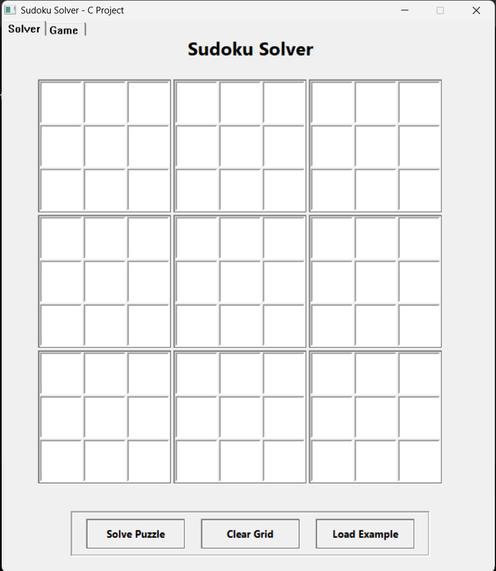
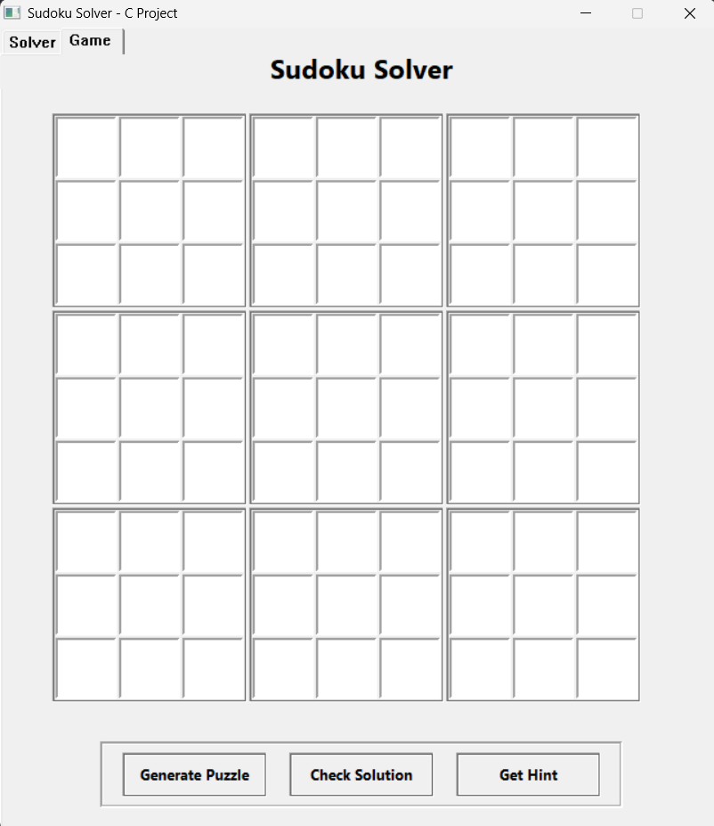

# Sudoku Solver with GUI and Game Mode

A comprehensive C-based Sudoku application with a graphical user interface featuring both a powerful puzzle solver and an interactive game mode. This dual-function application allows users to solve existing puzzles or play new randomly generated ones with hints and solution checking.

## Features

### Solver Tab
- **Interactive GUI**: Easy-to-use 9x9 grid for inputting puzzles
- **Fast Solving**: Uses backtracking algorithm for quick solutions
- **Input Validation**: Only accepts valid numbers (1-9) and checks for duplicates
- **Visual Feedback**: Clear separation of 3x3 blocks
- **Example Puzzles**: Load sample puzzles to test the solver

### Game Tab
- **Puzzle Generation**: Create random, solvable Sudoku puzzles
- **Solution Checking**: Verify if your completed puzzle is correct
- **Hint System**: Get up to 3 hints per puzzle to help you solve
- **Difficulty Levels**: Medium difficulty puzzles with proper number of clues

## Game Mode Features

The Game tab provides an interactive Sudoku experience:

### Puzzle Generation
- Automatic generation of valid Sudoku puzzles with unique solutions
- Each puzzle is guaranteed to be solvable using logic (no guessing required)
- Three difficulty levels (easy, medium, hard) with different numbers of clues

### Gameplay Features
- Real-time input validation prevents obvious mistakes
- Built-in hint system (limited to 3 hints per puzzle)
- Solution checking compares your answer with the known solution
- Clear visual feedback on correct/incorrect solutions

### Implementation Details
- Puzzle generation uses a diagonal-first approach for efficiency
- Difficulty is controlled by the number of clues removed
- The hint system strategically reveals cells to guide players
- All puzzles have exactly one solution to ensure fairness

## How to Build

### Prerequisites
- GCC compiler (MinGW recommended for Windows)
- Windows operating system

### Installation

**If you are on Windows and do not have `make` installed:**
- You can use the provided PowerShell script:
  ```powershell
  .\build.ps1
  ```
- Or, compile directly with GCC:
  ```powershell
  gcc -Wall -Wextra -std=c99 -O2 -o sudoku_solver.exe src/main.c src/sudoku.c src/gui.c -lgdi32 -luser32 -lkernel32 -lcomctl32
  ```

**If you have `make` installed (Linux/macOS or Windows with MinGW/MSYS2):**
- Compile the project:
  ```sh
  make
  ```
- Or for quick build:
  ```sh
  make quick
  ```

## How to Use

### Solver Tab
1. **Run the program**: Double-click `sudoku_solver.exe` or run `make run`
2. **Enter puzzle**: Click on cells and enter numbers 1-9 in the Solver tab
3. **Solve**: Click "Solve Puzzle" button to find the solution
4. **Clear**: Use "Clear Grid" to start over
5. **Load Example**: Click "Load Example" to try a sample puzzle

### Game Tab  
1. **Generate Puzzle**: Click "Generate Puzzle" to create a new random puzzle
2. **Play**: Fill in the empty cells with numbers 1-9
3. **Check Solution**: Click "Check Solution" when you think you've solved it
4. **Get Hints**: Use "Get Hint" button (3 hints available per puzzle)
5. **Switch Tabs**: Click between "Solver" and "Game" tabs at the top

## Example Puzzle

Try entering this puzzle:
```
5 3 _ | _ 7 _ | _ _ _
6 _ _ | 1 9 5 | _ _ _
_ 9 8 | _ _ _ | _ 6 _
------+-------+------
8 _ _ | _ 6 _ | _ _ 3
4 _ _ | 8 _ 3 | _ _ 1
7 _ _ | _ 2 _ | _ _ 6
------+-------+------
_ 6 _ | _ _ _ | 2 8 _
_ _ _ | 4 1 9 | _ _ 5
_ _ _ | _ 8 _ | _ 7 9
```

## Algorithms

### Solver Algorithm
Uses **backtracking** algorithm:
1. Find empty cell
2. Try numbers 1-9
3. Check if placement is valid (row, column, 3x3 box)
4. If valid, recursively solve rest
5. If no solution, backtrack and try next number

### Puzzle Generation Algorithm
The Game tab uses an advanced puzzle generation approach:
1. Fill diagonal 3x3 boxes first (these don't affect each other)
2. Solve the rest of the grid using the solver algorithm
3. Remove numbers strategically to create a puzzle with a unique solution
4. Different difficulty levels remove different numbers of clues

## Project Structure

```
sudoku_solver/
├── src/
│   ├── main.c     # Entry point and window creation
│   ├── sudoku.c   # Solving and puzzle generation algorithms
│   ├── sudoku.h   # Sudoku function declarations
│   ├── gui.c      # GUI implementation (solver & game tabs)
│   └── gui.h      # GUI function declarations & constants
├── Makefile       # Build configuration
├── build.ps1      # PowerShell build script for Windows
└── README.md      # This file
```

## Technical Details

- **Language**: C (C99 standard)
- **GUI**: Windows API (native) with Common Controls
- **Solver Algorithm**: Backtracking with constraint checking
- **Generation Algorithm**: Diagonal-first with unique solution guarantee
- **Tab Interface**: Windows Common Controls Tab Control
- **Time Complexity**: O(9^n) worst case, typically much faster
- **Space Complexity**: O(1) excluding recursion stack
- **Hint System**: Limited hints (3 per puzzle) based on known solution

## Screenshots

### Solver Tab
The Solver tab allows you to input and solve any valid Sudoku puzzle:


### Game Tab
The Game tab lets you play randomly generated puzzles:



## Contributing

Feel free to submit issues and enhancement requests! Some ideas for future improvements:

- Additional difficulty levels in Game mode
- Puzzle saving/loading functionality
- Timer for gameplay
- Score tracking and statistics
- Support for additional operating systems

## License

This project is open source. Feel free to use and modify as needed.
